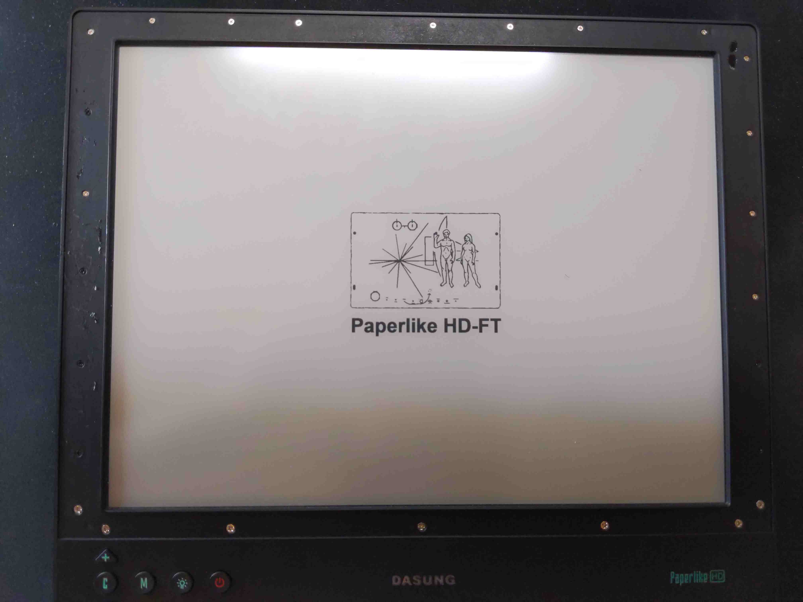
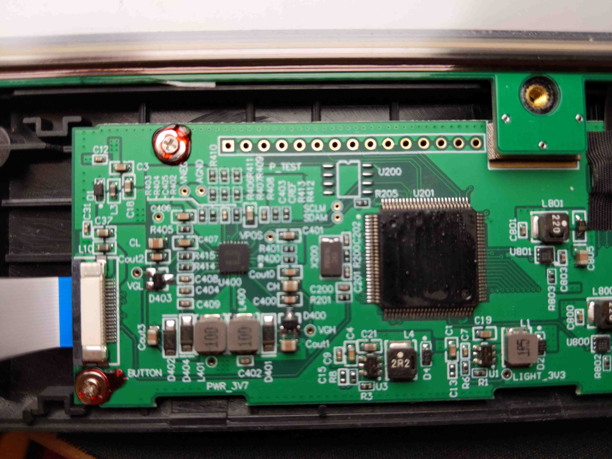

# Building an E Ink Laptop
A series where I'm documenting my process of building an eink laptop.[^dm]

|{.ui .celled .table .centered .bordered .large .image}|
|:---:|
|*The Dasung HD-FT eink monitor in it's original case paired with a headless Thinkpad T480.*|

## Background
Since the E Ink Corporation's founding in 1997 and the patenting of its microencapsulated electrophoretic display, or epaper, manufacturers started to incorporate e-ink film into consumer devices. Some of the first consumer devices where eink displays were found were ereaders: The Sony Librie in 2004 and Amazon Kindle in 2007.

Throughout the years, we've seen eink prototypes showcased in tech shows: larger eink screens, color, flexibility and most recently have started seeing eink displays being used in smartphones and tablets, notably from Hisense and Boox[^gpl] product lines.

## Why isn't there an E Ink Laptop?
And while eink has been around for 24 years, we have yet to see a laptop with an eink panel. There have been attempts in the past to create a similar device: Pixel Qi and OLPC, Boox Typewriter, Yoga book C930 and ThinkBook Plus. These attempts did not materialize, were discontinued, or are not sufficiently suitable to meet the demands of users due to hardware or lack of a cohesive UX/UI paradigm.

Fortunately, some of the most exciting work and innovation happening is in the eink modding community. There have been attempts at re-purposing ereaders: as a calendar, photo frame, daily quote. We've seen Kobo devices running GNU/Linux, The Amazon Kindle devices being repurposed as a development platform, the Remarkable 1 and 2 running Linux under the hood, and in the case of the Remarkable 1 running Parabola OS.

## Creating an E Ink Laptop

### Thinkpad T480
Write description of why the T480 would be a good choice as a laptop to turn into an eink monitor
### Dasung HD-FT
Why choose the Dasung HD-FT, what makes it stand-out

## Dasung Paperlike HD-FT teardown [^zettler]

### Opening the Dasung Paperlike HD-FT
|{#avatar .ui .centered .large .image}|
|:--:|
|*Pyring open the outer bezel of the display*|

Using a knife I was able to pry out the plastic part of the Dasung Monitor where it's glued. As I pryed everything open it I noticed the screws of different sizes that are a part of the monitor / panel, keeping it in place.

|{#avatar .ui .centered .large .image}|
|:--:|
|*Removed the outer bezel of the display*|

Removed all of the screws from the dasung monitor

After removing the screws was able to remove the piece that keeps it all together.

|{#avatar .ui .centered .large .image}|
|:--:|
|**|

I was able to open it and take a closer at the PCB's similar to Zettler's observation the chip's components were chemically peeled off to prevent reverse engineering. and similarly there were two pcb's, one for the eink display and another one to control the modes of the monitor.

|{#avatar .ui .centered .large .image}|
|:--:|
|**|

|{#avatar .ui .centered .large .image}|
|:--:|
|**|

|{#avatar .ui .centered .large .image}|
|:--:|
|**|

|{#avatar .ui .centered .large .image}|
|:--:|
|**|

|{#avatar .ui .centered .large .image}|
|:--:|
|**|

|{#avatar .ui .centered .large .image}|
|:--:|
|**|

|{#avatar .ui .centered .large .image}|
|:--:|
|**|

|{#avatar .ui .centered .large .image}|
|:--:|
|**|

|{#avatar .ui .centered .large .image}|
|:--:|
|**|

|{#avatar .ui .centered .large .image}|
|:--:|
|**|

According to the panel that was disassembled, this appears to be the e-ink panel that seems to be used: ES133TT3 [^ES133TT3]:

### The Dasung E-Ink display module

### The Control Boards

[^dm]: If you think this note resonated, be it positive or negative, Send me a [direct message](https://twitter.com/messages/compose?recipient_id=4648173315) on [Twitter](https://twitter.com/alexsoto_dev) and we can talk. Also ping if you'd like to know the updates on this note.

[^zettler]: This post is inspired from Kev Zettler's, [Dasung Paperlike Pro Teardown](https://kevzettler.com/2018/02/11/dasung-paperlike-pro-teardown/).

[^ES133TT3]: https://www.panelook.com/ES133TT2_E%20Ink_13.3_EPD_overview_27058.html

[^gpl]: Onyx is violating the Linux kernel's license, refuses to release source code, https://news.ycombinator.com/item?id=23735962
