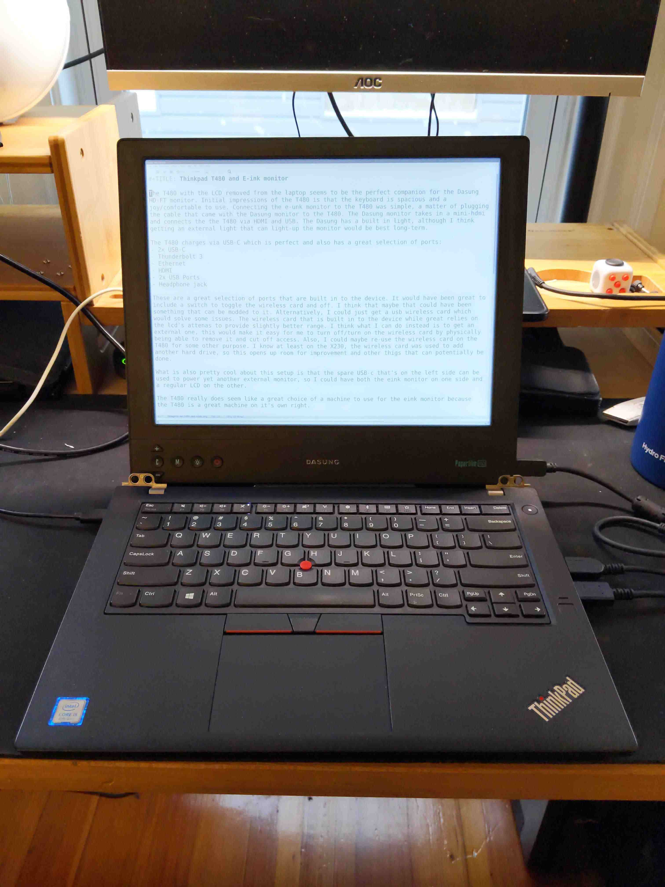

# Building an E Ink Laptop

A series where I'm documenting my process of designing and building an eink laptop.[^dm]
- [[[a59a7e98]]]
- [[[d8704fc7]]]
- [[[cdd25564]]]
- [[[3b925636]]]
- [[[d63401df]]]
- [[[ecf1ae6f]]]
- [[[8eed2903]]]

|{.ui .celled .table .centered .bordered .large .image}|
|:---:|
|*The Dasung HD-FT eink monitor in it's original case paired with a headless Thinkpad T480.*|

## Background
Since the E Ink Corporation's founding in 1997 and the patenting of its microencapsulated electrophoretic display, or epaper, manufacturers started to incorporate e-ink film into consumer devices. [^eink-founding]. Some of the first consumer devices where eink displays were found were ereaders: The Sony Librie in 2004[^sony] and Amazon Kindle in 2007 [^kindle].

Throughout the years, we've seen eink prototypes showcased in tech shows: eink-film used with larger screens, color, flexibility and most recently have started seeing eink displays being used in smartphones and tablets, notably from Hisense and Boox[^gpl] product lines. And while eink has been around for 24 years, we have yet to see a laptop with an eink panel.

## Why isn't there an E Ink Laptop?
There have been attempts in the past to create a similar device: Pixel Qi and OLPC[^pixelqi], Boox Typewriter[^boox typewriter], Yoga Book C930[^C930] and ThinkBook Plus. These attempts did not materialize, were discontinued, or were not sufficiently suitable to meet the demands of users due to hardware or lack of a cohesive UX/UI paradigm. To make matters worse, the E Ink Corporation's holds the patents for it's eink technology and only licenses it's technology to large manafacturers making availability or mass adoption difficult.[^patent]

Fortunately, some of the most exciting work and innovation happening today is in the eink modding community. There have been attempts at re-purposing ereaders: as a calendar and used to display a static image or site. We've seen Kobo devices running GNU/Linux, The Amazon Kindle devices being repurposed as a development platform, the Remarkable 1 and 2 running Linux under the hood, and PINE 64 recently announcing a native e-ink single board computer[^pine64].

## Creating an E Ink Laptop
In my quest of creating an e-ink laptop, I've decided to use a 'headless' Thinkpad T480 [^pi] and a Dasung HD-FT [^dasung].

### Thinkpad T480
The Thinkpad T480, seems to be an ideal laptop for building an eink laptop, The T480 has[^t480]:

- A hot-swappable battery (an internal and external).
- With the 72Wh battery up 13 hours of battery or more with web browsing.
- Supports up to 64 GB of ram
- Two Nvme drives (type 2280 and 2242).
- Standard HDMI port, USB-C, Thunderbolt 3, Headphone jack, Ethernet and SD cart slot.
- Uses a standard USB-C charger. [^thinkplus]
- Lightweight and portable
- Can be modded to use the classic 7-row keyboard. [^xytech]

The T480 will be an upgrade over my modded Thinkpad X230 and become my daily driver for the next few years.

### Dasung HD-FT
Why choose the Dasung HD-FT, what makes it stand-out

[^eink-founding]: [E Ink - Wikipedia](https://en.wikipedia.org/wiki/E_Ink)

[^dm]: If you think this post resonated, be it positive or negative, Send me a [direct message](https://twitter.com/messages/compose?recipient_id=4648173315) on [Twitter](https://twitter.com/alexsoto_dev) and we can talk. Also ping if you'd like to know the updates on this post.

[^zettler]: This post is inspired from Kev Zettler's, [Dasung Paperlike Pro Teardown](https://kevzettler.com/2018/02/11/dasung-paperlike-pro-teardown/).

[^ES133TT3]: [Panelook E Ink ES133TT3](https://www.panelook.com/ES133TT3_E%20Ink_13.3_EPD_overview_31869.html)

[^gpl]: [Onyx is violating the Linux kernel's license, refuses to release source code](https://news.ycombinator.com/item?id=23735962)

[^pine64]: [Pine64 Announces a Native E-ink Single Board Computer](https://www.makeuseof.com/quartz64-e-ink-sbc/)

[^pi]: Inspired by the [Raspbery Pi 400](https://www.raspberrypi.org/products/raspberry-pi-400/) and [Commodore 64](https://en.wikipedia.org/wiki/Commodore_64).

[^dasung]: [Dasung's Shopify Store](https://dasung-tech.myshopify.com/products/dasung-e-ink-paperlike-hd-front-light-and-touch-13-3-monitor?variant=34835004850333)

[^T480]: Video: [Best used ThinkPad to buy in 2020?](https://www.youtube.com/watch?v=621WJlMJq98)

[^thinkplus]:[thinkplus Portable Lightweight 65W USB-C Wall PD Charger](https://www.amazon.com/dp/B07RGTHQNW/)

[^xytech]: [T25 Frankenpad](https://www.xyte.ch/thinkpads/t25-frankenpad/)

[^pixelqi]: [Breaking News: OLPC & Pixel Qi to Share XO Laptop Screen Patents AND All Current & Future Display IP](http://www.olpcnews.com/hardware/screen/breaking_news_olpc_pixel_qi_to.html)

[^sony]: [Sony Librie - Wikipedia](https://en.wikipedia.org/wiki/Sony_Reader)
[^kindle]: [Live from the Amazon Kindle launch event](https://www.engadget.com/2007-11-19-live-from-the-amazon-kindle-launch-event.html)

[^boox typewriter]: [This weird e-ink laptop is my dream computer](https://www.theverge.com/circuitbreaker/2017/4/11/15264394/boox-typewriter-e-ink-laptop-is-my-dream-computer)

[^C930]: [Lenovo Yoga Book C930 review: two screens and lots of compromises](https://www.theverge.com/2018/10/25/18019840/lenovo-yoga-book-c930-review-e-ink-tablet-laptop-windows)

[^patent]: [Ask HN: Why are e-ink note-taking devices so expensive compared to iPads?] (https://news.ycombinator.com/item?id=26143407)
