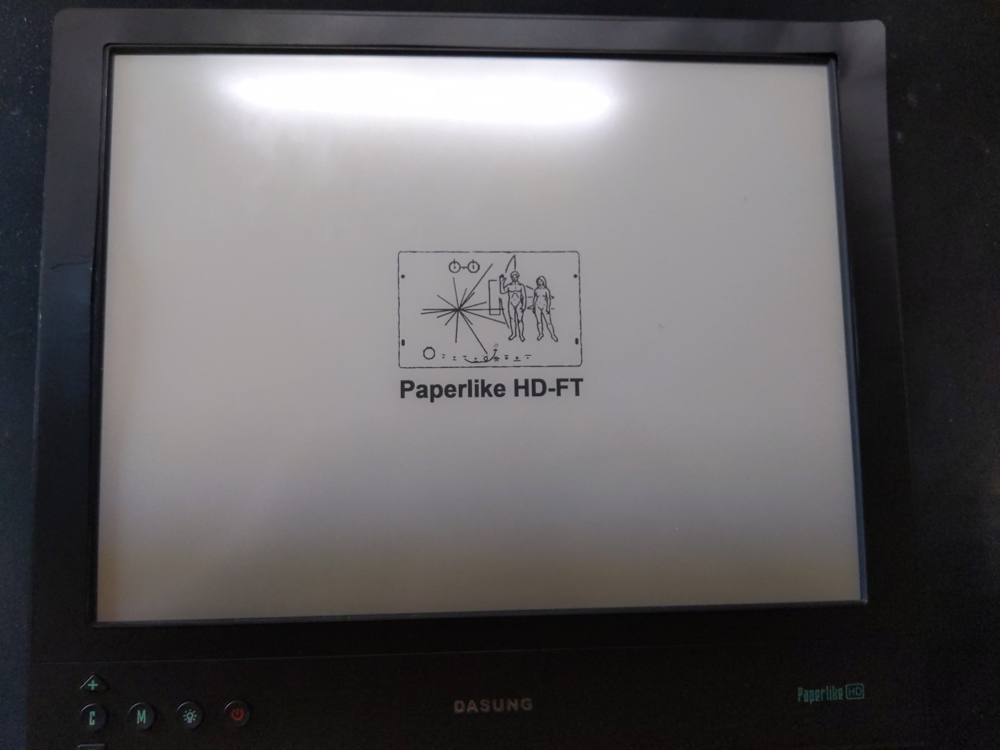

# Building an E-Ink Laptop

{.ui .right .floated .small .image}

A series where I'm documenting my process of designing and building an e-ink laptop.
- [[[dasung-paperlike-hdft-teardown]]]
- [[[challenges-building-an-open-source-eink-laptop]]]

## Background
Since the E Ink Corporation's founding in 1997 and the patenting of its microencapsulated electrophoretic display, or epaper, manufacturers started to incorporate e-ink film into consumer devices. [^e-ink-founding]. Some of the first devices were ereaders: The Sony Librie in 2004[^sony] and the Amazon Kindle in 2007 [^kindle].

Throughout the years, we've seen several e-ink products and prototypes: e-ink film used with larger screens[^dasung25], color[^kaleido], flexible material[^flexible] and most recently have started seeing e-ink displays used in smartphones and tablets, notably from Hisense and Onyx Boox product lines. And while e-ink has been around for 24 years, we have yet to see a laptop with an e-ink panel.

## Why isn't there an E Ink Laptop?
There have been attempts in the past to create a similar device: Pixel Qi and OLPC[^pixelqi], Boox Typewriter[^boox typewriter], Yoga Book C930[^C930] and the ThinkBook Plus[^thinkbook-plus]. These attempts did not materialize, were discontinued, or were not sufficiently suitable to meet users' demands due to hardware or lack of a cohesive UX/UI paradigm. ~~To make matters worse, the E Ink Corporation holds the patents for its e-ink technology and only licenses its technology to large manufacturers making availability or mass adoption difficult.~~[^patent]

Fortunately, some of the most exciting work and innovation happening today is in the e-ink modding community[^e-ink-mechanical]. There have been attempts to re-purposing ereaders: as a calendar,[^cal] to display a static image or site[^nyt], Kobo devices running GNU/Linux[^kobo], Amazon Kindle devices repurposed as a development platform[^kindledev], the Remarkable 1 running Parabola[^rm1], and PINE 64 recently announcing a native e-ink single-board computer[^pine64].

After following the development of e-ink for some time, I've decided to re-use some of the existing hardware I have and create an e-ink laptop.

## Why do you want to build an E Ink laptop?
From about 6 am to 7 pm, I'm in front of a computer or digital device that's emitting blue light. Throughout the day, I'm supporting students, attending meetings, reading documentation, news articles, programming, learning, using emacs and org-mode to capture information, write down thoughts, create tasks, and conversing with my knowledge management system.

I try to use my e-ink monitor as much as possible throughout the day to reduce eye strain, fatigue and lessen distractions while intermittently taking breaks. The Dasung monitors go a long way to make this possible when I'm home or in a stationary place. Though there are times, I'm not working in front of my desktop or would like to work at a different location. The teardown and set-up of my environment when using an e-ink monitor is somewhat tedious, in addition to changes having to make when switching from an LCD to an e-ink monitor:

- making adjustments and tweaks to the window manager.
- adjusting font sizes.
- changing themes in different applications.

I am then having to switch the changes back when using an LCD for meetings or videos. I've already solved some of this by writing some scripts and making adjustments in some applications. Still, I would like to design the experience for using an e-ink monitor with a dedicated device from the ground-up.

## Creating an E Ink Laptop

I'll be using a 'headless' Thinkpad T480 [^pi] combined with the Dasung HD-FT [^dasung].

{.ui .centered .medium .image}

## Thinkpad T480

The Thinkpad T480 seems to be an ideal laptop for building an e-ink laptop, The T480 has [^t480]:
- A hot-swappable battery (internal and external).
- 13 hours of battery while web browsing with the 72Wh battery.
- Supports up to 64 GB of ram.
- Two Nvme drives (type 2280 and 2242).
- Standard HDMI port, USB-C, Thunderbolt 3, Headphone Jack, Ethernet, and SD card slot.
- Uses a standard USB-C charger. [^thinkplus]
- Lightweight and portable.
- It can be modded to use the classic 7-row keyboard. [^xytech]

The hot-swappable battery and long battery life are essential for any portable setup, especially with an e-ink monitor. The T480 supports up to 64Gb of ram and two Nvme drives, providing plenty of power and expansion as a daily driver.

Since the Dasung monitors connect via HDMI and receives power through USB, the T480 has all of the necessary ports without an adapter. Lastly, after removing the lid cover with the T480, there is room here to hack and mod the Dasung screen to the T480.

{.ui .medium .spaced .image}
{.ui .medium .spaced .image}

## Dasung HD-FT

Dasung currently is the only manufacturer of e-ink monitors that I'm aware of [^gpl], and their third-generation monitors are a substantial upgrade from prior generations.

{.ui .centered .medium .image}

Directly from the monitor, you can:
- Change image modes (M1, M2, M3, Fast, Fast+, Fast++, Black, Black+, Black++)
- Adjust contrast
- Clear the screen
- Turn on and off the backlight

The ability to easily change the monitor's modes without software, the fast screen refresh, screen resolution of 2200×1650 and the backlight make it a great base to build an e-ink laptop.

## Next Steps
The first post went over my reasons for building an e-ink laptop, some history about e-ink technology, the e-ink modding community, recent advancements, and the hardware I've selected to create an e-ink laptop.

The next post in the series will be a teardown of the Dasung HD-FT, inspired by Kev Zettler's work on the Dasung Paperlike Pro.[^zettler]

{.ui .horizontal .divider .header}

## About
{#avatar .ui .left .floated .small .image}

Hi, I’m Alexander Soto.

I’m a community organizer, educator, software engineer, hacktivist, and agent of social change. My interests are in exploring community-building, social justice, education, and leveraging technology to address social problems.

In the past, I’ve worked as a labor rights organizer, a teacher, and I’m currently the Project Lead at [EI2030](https://ei2030.org/), an Expert In Residence at [Resilient Coders](https://www.resilientcoders.org/), and founder of [Modos](https://www.modos.tech/).

I enjoy tinkering/playing/breaking things, 3D printing, painting, playing piano, swimming, and writing in my spare time.

This site is the [scattered and unfinished version of my thoughts](https://alexsoto.dev/impulse.html) while documenting what I’m currently learning and exploring.

If you’d like to know the updates of a post, have questions, comments, suggestions, or would like to collaborate, send me a [direct message](https://twitter.com/messages/compose?recipient_id=4648173315) on [Twitter](https://twitter.com/alexsotodev), or an [email](mailto:contact@alexsoto.dev) and we can talk.

<section id="subscriptionLinks"></section>

<section id="socialMediaLinks"></section>

[^e-ink-founding]: [E Ink - Wikipedia](https://en.wikipedia.org/wiki/E_Ink)

[^pine64]: [Pine64 Announces a Native E-ink Single Board Computer](https://www.makeuseof.com/quartz64-e-ink-sbc/)

[^thinkbook-plus]: [Lenovo’s ThinkBook Plus Gen 2 has an even bigger and better E Ink display on the lid](https://www.theverge.com/2021/1/12/22226031/lenovo-thinkbook-plus-gen-2-e-ink-lid-display-ces-2021)

[^pi]: Inspired by the [Raspbery Pi 400](https://www.raspberrypi.org/products/raspberry-pi-400/) and [Commodore 64](https://en.wikipedia.org/wiki/Commodore_64).

[^dasung]: [Dasung's Shopify Store](https://dasung-tech.myshopify.com/products/dasung-e-ink-paperlike-hd-front-light-and-touch-13-3-monitor?variant=34835004850333)

[^T480]: Video: [Best used ThinkPad to buy in 2020?](https://www.youtube.com/watch?v=621WJlMJq98)

[^thinkplus]:[thinkplus Portable Lightweight 65W USB-C Wall PD Charger](https://www.amazon.com/dp/B07RGTHQNW/)

[^xytech]: [T25 Frankenpad](https://www.xyte.ch/thinkpads/t25-frankenpad/)

[^pixelqi]: [Breaking News: OLPC & Pixel Qi to Share XO Laptop Screen Patents AND All Current & Future Display IP](http://www.olpcnews.com/hardware/screen/breaking_news_olpc_pixel_qi_to.html)

[^sony]: [Sony Librie - Wikipedia](https://en.wikipedia.org/wiki/Sony_Reader)
[^kindle]: [Live from the Amazon Kindle launch event](https://www.engadget.com/2007-11-19-live-from-the-amazon-kindle-launch-event.html)

[^boox typewriter]: [This weird e-ink laptop is my dream computer](https://www.theverge.com/circuitbreaker/2017/4/11/15264394/boox-typewriter-e-ink-laptop-is-my-dream-computer)

[^C930]: [Lenovo Yoga Book C930 review: two screens and lots of compromises](https://www.theverge.com/2018/10/25/18019840/lenovo-yoga-book-c930-review-e-ink-tablet-laptop-windows)

[^patent]: Correction, this is an unsubstantiated claim. [Ask HN: Why are e-ink note-taking devices so expensive compared to iPads?](https://news.ycombinator.com/item?id=26143407)

[^flexible]: Video: [E Ink releases new flexible and foldable 32 inch E-Paper Display](https://www.youtube.com/watch?v=j5Jf_3xqpF8)

[^kaleido]: Video: [The Color E-Reader is Here: Hands-On with E Ink "Kaleido" on the PocketBook Go](https://www.youtube.com/watch?v=OlnzrxaZViU)

[^dasung25]: [DASUNG Releasing Large Size 25.3" E-ink Monitor: Paperlike 253](https://www.youtube.com/watch?v=RRvlJ2HjH30)

[^e-ink-mechanical]: [E-ink ergo cyberdeck ideas](https://www.reddit.com/r/eink/comments/lo5hkk/eink_ergo_cyberdeck_ideas/)

[^cal]: [Building an E-Ink Calendar, and a UI Toolkit along the way](https://rahulrav.com/blog/e_ink_dashboard.html)

[^nyt]: [An updated daily front page of The New York Times as artwork on your wall](https://alexanderklopping.medium.com/an-updated-daily-front-page-of-the-new-york-times-as-artwork-on-your-wall-3b28c3261478)

[^kobo]: [Kobo Mini running Debian Linux tablet](https://www.youtube.com/watch?v=8rkoHcJGo18)

[^kindledev]: [Turning an old Amazon Kindle into a eink development platform](https://blog.lidskialf.net/2021/02/08/turning-an-old-kindle-into-a-eink-development-platform/)

[^rm1]: [Parabola-rM](http://www.davisr.me/projects/parabola-rm/)

[^zettler]: [Dasung Paperlike Pro Teardown](https://kevzettler.com/2018/02/11/dasung-paperlike-pro-teardown/)

[^gpl]: While Onyx Boox has made Android Tablets that can be used as a secondary monitor, in my experience with the Onyx Boox Max 2, the referesh rate and performance was no where near comparable to a comparable Dasung monitor of the same generation. In addition, there have been reports that [Onyx is violating the Linux kernel's license, refuses to release source code](https://news.ycombinator.com/item?id=23735962), as such I would prefer to not support them.
