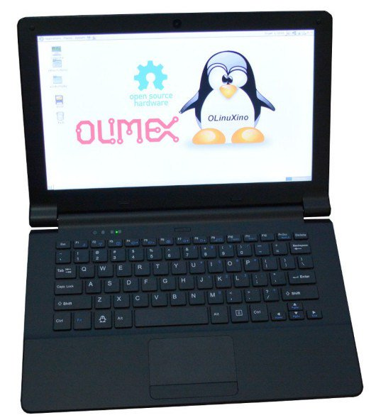
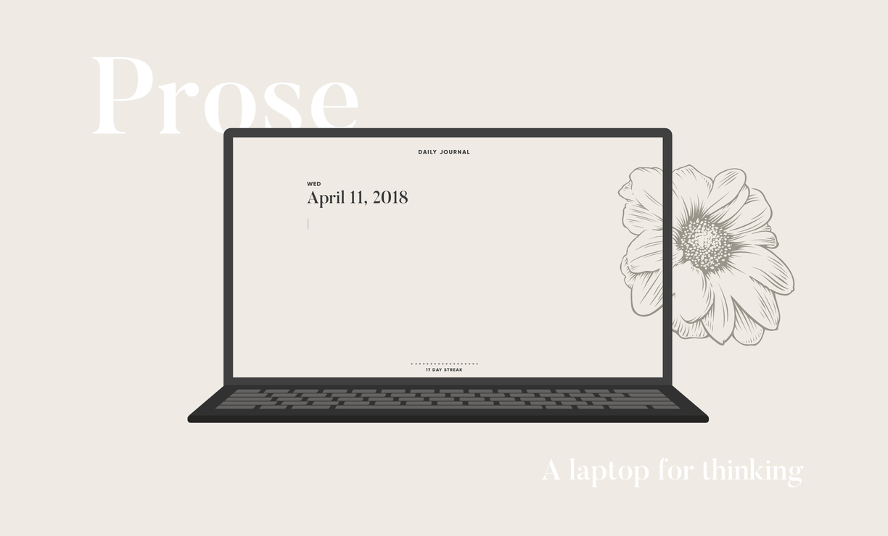

# Challenges Building an Open-Source E Ink Laptop

{.ui .right .floated .small .image}

In a previous article, I discussed my intention of [[building-an-e-ink-laptop]]. In this article, I want to introduce [EI2030](https://ei2030.zulipchat.com/register/) and how we are building an open-source eink laptop and its challenges.

This article wouldn't be possible without the following contributors:
- [@initrd](https://twitter.com/_initrd)
- [@Manuel_Zeiler](https://twitter.com/Manuel_Zeiler)
- [@zephray_wenting](https://twitter.com/zephray_wenting)
- [@xorlof](https://twitter.com/xorlof)
- [@AnjanKatta](https://twitter.com/AnjanKatta)
- [@tom.cxphillips](https://twitter.com/tomcxphillips)

Thank you for your time, support and dedication.

## EI2030

 

The [EI2030](https://forum.ei2030.org/) community started about a year ago amidst the COVID-19 pandemic, the transition to remote-working, and the increasing amount of time we spend on our digital devices. The goal of EI2030 is to promote healthier computing practices, particularly the use of non-emissive displays such as e-ink and connecting people who are interested in learning and discussion, thereby facilitating the exchange of ideas and collaboration. Our community is open to everyone and consists of a broad mix of hardware hackers, health-tech enthusiasts, productivity hackers, gadget lovers, and entrepreneurs.

Recently at EI2030, we've launched our [Community Built E-Ink Laptop Project.](https://forum.ei2030.org/t/proposal-ei-2030-the-community-built-e-ink-laptop-project/) The project's objective is to build a proof of concept of an e-ink laptop, and as a community, we pool our resources, knowledge, and expertise. To achieve our objective, we are organized into working groups.

## Working Groups

[Working groups](https://forum.ei2030.org/t/about-ei2030-working-groups/132) focus on a specific objective related to building an eink laptop and are led by one or two people. The working groups are timeboxed and document their processes, and, as a result, share the resources, knowledge, and lessons learned for future groups.

Some of our current working groups are:

- [PaperTerm](https://forum.ei2030.org/t/paperterm-project-definition-and-marketing-materials/146/5)

 

PaperTerm is a niche device with an e-paper-display and laptop form-factor device with a week of battery life (of regular use). PaperTerm is a microcontroller-based project used solely to connect to and run/interact with programs installed on remote computers (think along the lines of SSH/telnet, remote desktop, VNC, etc.). The combination of its limited scope and e-ink display is what will enable its vision of a "so long that I don't have to think about it" battery life.

- [Low-Power E-Paper OS](https://forum.ei2030.org/t/research-porting-linux-to-ultra-low-power-microcontroller/151/1)

 

The Low-power E-Paper OS objective is to explore the available RTOSes and develop a Linux port from scratch for the Ambiq Apollo 3 & 4[^ambiq4] series processors or similar ultra low power microcontroller. The research from this group will support future/current working groups.

- [Drivers for E-ink displays](https://forum.ei2030.org/t/research-drivers-for-eink-displays/150)

{.ui .medium .images .centered}

 

The Drivers for E-Ink display's objective in the near term is to explore the different ways to drive an eink display, focusing on using a system on a chip with an integrated controller; i.MX7/8[^imx7] and RK3566[^rk3566] family of microcontrollers. Evaluation kits and boards will be shared and distributed among group members. In the long-term, we are interested in building an open-source external electrophoretic display controller[^epdc] enabling higher performance processors and flexibility with the implementation of the waveforms with eink devices. The research from this group will support future/current working groups.

- Laptop Chassis
{.ui .medium .images .centered}

 

The objective of the group is to research, design, and create/remix a laptop chassis that can be the foundation for building an eink laptop and for current/future working groups. Preference will be for designs used with open-source software to enable the use of open-hardware—for example, Olimex TERES-I[^diy-laptop], VIA OpenBook[^openbook], MNT Reform[^mnt-reform], and EOMA68[^eoma68].

- Non-Emissive Displays
{.ui .medium .images .centered}

 

The objective of this working group is to discuss non-emissive displays, mainly focusing on e-ink, RLCD, DES, and alternatives. The group will concentrate on creating prototypes and learning more about display physics. Research on non-emissive displays' developments will be distilled and shared for current/future working groups.

- [Psychology and UX of e-ink](https://forum.ei2030.org/t/working-group-definition-psychology-and-ux-of-e-ink/163/)

{.ui .medium .images .centered}

 

The objective of this group is to investigate possible psychological benefits of e-ink. Many eink users anecdotally report such benefits when compared with their experience of LCD, OLED, or other types of display. For example, lower levels of screen/eye fatigue. Previous published work has not been resoundingly conclusive (e.g. Benedetto et al., 2013[^Benedetto2013]; Benedetto et al., 2014[^Benedetto2014]; Siegenthaler et al., 2012[^Siegenthaler2012]).

We will investigate for ourselves whether these anecdotally reported benefits amount to empirically verifiable and generalisable properties of eink displays. We will also be ideating and investigating ways to design the UX of eink devices to improve things like productivity and well-being through psychology!

## Challenges
From the day-to-day conversations with members from EI2030, research related to e-ink development, and the process of building an eink laptop, we've identified some challenges associated with building an eink laptop.

### Sourcing the display

{.ui .medium .images .centered}

 

To build a laptop with an eink screen, the eink panels that we'll consider fall in the range of 10.3 to 13.3inches. The eink panels that fit these criteria and are in production according to Panelook are the ES103TC11[^103TC1], ED133UT22[^133UT2], and the ES133TT33:[^133TT3]. Dasung[^Dasung], Waveshare[^Waveshare], Sony[^Sony], and other companies' product lines use the panels listed.

We can use the panels present on existing eink devices, second-hand markets, wholesale in bulk, or other distributors to build a proof of concept. Afterward, it will be difficult at scale to fulfill the minimum order quantity. According to conversations I've had, the minimum order quantity(MOQ) required for purchase at one time is between 10,000 to 50,000.[^moq]

Given the challenges stated above, another option is not to use E Ink but rather a different non-emissive display technology such as Display Electronic Slurry (DES)[^des] or Reflective Liquid Crystal Display (RLCD)[^rlcd].

DES is used in the displays offered by Good Display. Some of the notable features of using a DES display are an improved: pixel structure, contrast, resolution, operating temperature, power consumption, and cost. Additionally, an MOQ is not required. We are waiting for Good Display to have DES displays in stock to purchase a display and conduct tests and compare these results to e-ink, RLCD, etc.

RLCDs[^rlcd2] are an alternative reflective display technology that is attractive as they are cheaper than eink, don't require unique waveforms/firmware/controllers, have week-long battery life, and most excitingly, can do 60fps! Sharp from Japan is the leading maker of RLCDs today, BOE as well. RLCDs are the displays that are in your microwave, oven, & TI calculator. But they also were the displays in your Gameboy & Pebble Watch[^pebble]. And if you have a Garmin smartwatch today, it likely has an RLCD with a backlight - 'a transflective RLCD'.

Transflective RLCDs came to fame with the One Laptop per Child project[^olpc], Pixel Qi tech,[^pixelqi] & now can be found in a variety of smartwatches. However, there is currently no mass market high-resolution tablet/monitor-sized transflective RLCDs. The main benefit of transflective is outdoor visibility, this is useful in outdoor smartwatches, but it is hard to understand the need for this in tablets & monitors'.

This chicken & egg problem of perceived lack of application & demand and thus lack of suppliers producing such displays is how in 2021 we still don't have available a technology that is multiple decades old. However, the advent of 'eye comfort' to describe displays that don't cause eye strain in China, in many ways pioneered by Hisense, has created a niche & a quantifiable market opportunity for transflective RLCDs to fulfill.

There is still the bootstrapping problem of creating enough demand to satisfy a manufacturer's 'MOQ' (minimum order quantity) such that they will actually produce such displays. If enough of us get together & show interest, there may be a way to solve this chicken & egg problem by getting a manufacturer to bite in making tablet/monitor-sized RLCDs or another non-emissive display.

### Interface to an E Ink display

 

Let's assume that we can attain an eink panel either directly from E Ink or a second-hand marketplace; how would we drive the eink display? Wenting Zhang's post, Basics of driving E-paper displays[^Zhang] provides a detailed account of its components and ways to drive the screens.

There are three ways to drive an eink display:
- Using a dedicated controller chip to drive the screen.
- Using a System on a Chip(SoC)[^SoC] that has an integrated controller.
- Using a fast microcontroller unit to emulate the controller with GPIO.

Zhang provides some examples:

- Closed-source / Commercial: EPSON S1D13xxx[^S1D13C00], IT8951[^IT8951], Waveshare HDMI driver board[^Waveshare], Dasung E-ink monitors[^Dasung].
- SoC with integrated controller: RK29xx[^rk29xx], RK3026[^rk3026]/RK3028[^rk3028], i.MX 6S/D, i.MX 7S/D[^imx7],i.MX 8ULP[^imx8], RK3566/RK3568[^rk3566]
- MCU + Software TCON: essentialscrap[^essentialcrap], NekoCal[^NekoCal], InkPlate  6/10[^inkplate], EPDiy[^epdiy]

The [Drivers for E-Ink group](https://forum.ei2030.org/t/research-drivers-for-eink-displays/) will be exploring the use of i.MX7/8, RK3566 SoC's and building an open-source external electrophoretic display controller(EPDC)[^epdc] enabling the use of higher performance processors and open-source waveforms.

The waveform[^US20170168370A1] is a look-up table that the controller uses to determine how to drive the screen. There are two types of waveforms: vendor waveforms and open-source waveforms. The vendor waveforms cannot be distributed and are not easily obtainable because NDAs protect them. On the other hand, open-source waveforms can be created by a community and used in open-source projects. However, open-source waveforms have limited performance, are missing some critical features, and are not compatible with vendor waveforms.

Building an open-source external EPDC would enable people to source an eink panel of their choosing and drive them. We can create a database[^eink-db] of eink panels that are used on eink devices and create compatible open-source waveforms. This database would serve as a reference for people to use when buying from a second-hand marketplace.

### The Laptop Chasis
{.ui .medium .images .centered}

 

The laptop chassis is also another major consideration to think about when building an eink laptop. The aspect ratio, for example, found in the 10.3 and 13.3 screens is 4:3[^133TT3]. Most companies have for some time now moved on to using 16:9 as the default for their screen. I'm unaware of an original design manufacturer[^odm] that makes a laptop chassis for a 4:3 aspect ratio, to the best of my knowledge. Where do we go from here?

We could create the laptop from scratch, but what about exploring existing open-source design and hardware? One of the earliest examples is the VIA OpenBook[^openbook], a laptop reference design revealed in 2008 that made their design files open source [^15-openbook]. Some other options are the MNT Reform[^mnt-reform] and the EOMA68[^eoma68] that have also made their design files open and available for others.

I've recently have come across the Olimex TERES-1[^TERES] an open-hardware and open-source laptop[^diy-laptop]. Some of the interesting features about this laptop are that it's split into five parts rather than having a motherboard constructed as one piece[^assemble]. The design files are freely available and produced in KiCAD. While an ODM made the case, a member from the community created a case for it in FreeCAD.[^forksand]

Spare parts for the TERES-I are available on the Olimex website. Since the design files for the case and its PCBs are available, it is a strong candidate to build an open-source eink laptop. In addition to the above, we can contribute to the Olimex open-source ecosystem by creating an open-source EPDC expansion board and modifying the chassis to be fitted with an eink panel.

## Next Steps
In this article, I introduced EI2030, our working groups, and the challenges with building an open-source eink laptop: sourcing the eink displays, interfacing with the display, and creating the laptop chassis.

Our next steps to create a prototype of an open-source eink laptop are:

- Create space for community members to provide feedback, suggestions and ask questions.
- Development on the open-source EPDC.
- Work on the laptop chassis.
- Embedded Linux development.
- Perform a UX/UI Study.

## An Invitation
If any of the work we are doing piqued your interest, we invite you to join our:
- [Zulip](https://ei2030.zulipchat.com/register/)
- [Forum](https://forum.ei2030.org/categories)
- [Book time](https://alexsoto.dev/office-hours.html) during my office hours to talk further.

Our team is looking for folks with experience in:
- Embedded Linux development
- Mechanical engineering / CAD

We are open to everyone joining, regardless of your skillset, and I believe we all have something to contribute to the community we are building and shaping together.

<blockquote class="twitter-tweet">
Let&#39;s build an open-source eink laptop together. 💻<a href="https://t.co/YGZ3FzG898">https://t.co/YGZ3FzG898</a>  🤔Interested? Come join us!🎉<a href="https://twitter.com/hashtag/ei2030?src=hash&amp;ref_src=twsrc%5Etfw">#ei2030</a> <a href="https://twitter.com/hashtag/eink?src=hash&amp;ref_src=twsrc%5Etfw">#eink</a> <a href="https://twitter.com/hashtag/einklaptop?src=hash&amp;ref_src=twsrc%5Etfw">#einklaptop</a> <a href="https://twitter.com/hashtag/openhardware?src=hash&amp;ref_src=twsrc%5Etfw">#openhardware</a> <a href="https://twitter.com/hashtag/opensource?src=hash&amp;ref_src=twsrc%5Etfw">#opensource</a> <a href="https://twitter.com/hashtag/kicad?src=hash&amp;ref_src=twsrc%5Etfw">#kicad</a> <a href="https://twitter.com/hashtag/freecad?src=hash&amp;ref_src=twsrc%5Etfw">#freecad</a> <a href="https://twitter.com/hashtag/showyourwork?src=hash&amp;ref_src=twsrc%5Etfw">#showyourwork</a> <a href="https://twitter.com/hashtag/buildinpublic?src=hash&amp;ref_src=twsrc%5Etfw">#buildinpublic</a>
&mdash; Alexander Soto (@alexsotodev) <a href="https://twitter.com/alexsotodev/status/1385200873563951106?ref_src=twsrc%5Etfw">April 22, 2021</a></blockquote> 

## About
{#avatar .ui .left .floated .small .image}

Hi, I’m Alexander Soto.

I’m a community organizer, educator, software engineer, hacktivist, and agent of social change. My interests are in exploring community-building, social justice, education, and leveraging technology to address social problems.

In the past, I’ve worked as a labor rights organizer, a teacher, and I’m currently the Project Lead at [EI2030](https://ei2030.org/), an Expert In Residence at [Resilient Coders](https://www.resilientcoders.org/), and founder of [Modos](https://www.modos.tech/).

I enjoy tinkering/playing/breaking things, 3D printing, painting, playing piano, swimming, and writing in my spare time.

This site is the [scattered and unfinished version of my thoughts](https://alexsoto.dev/impulse.html) while documenting what I’m currently learning and exploring.

If you’d like to know the updates of a post, have questions, comments, suggestions, or would like to collaborate, send me a [direct message](https://twitter.com/messages/compose?recipient_id=4648173315) on [Twitter](https://twitter.com/alexsotodev), or an [email](mailto:contact@alexsoto.dev) and we can talk.

<section id="subscriptionLinks"></section>

<section id="socialMediaLinks"></section>

## Links

[^103TC1]: https://www.panelook.com/ES103TC1_E%20Ink_10.3_EPD_overview_34953.html
[^133UT2]: https://www.panelook.com/ED133UT2_E%20Ink_13.3_EPD_overview_31868.html
[^133TT3]: https://www.panelook.com/ES133TT3_E%20Ink_13.3_EPD_overview_31869.html
[^Dasung]: https://dasung-tech.myshopify.com/
[^Waveshare]: https://www.waveshare.com/product/raspberry-pi/displays/e-paper.htm
[^Sony]: https://www.sony.com/electronics/digital-paper-systems/t/digital-paper-notepad
[^Zhang]: https://hackaday.io/project/11537-nekocal-an-e-ink-calendar/log/191001-basics-of-driving-e-paper-displays
[^SoC]: https://en.wikipedia.org/wiki/System_on_a_chip
[^moq]: I will update this number once I get confirmation from E Ink
[^des]: https://www.good-display.com/companyfile/20.html
[^rlcd]: https://patents.google.com/patent/US6693689B1/en
[^olpc]: https://en.wikipedia.org/wiki/One_Laptop_per_Child
[^pixelqi]: https://en.wikipedia.org/wiki/Pixel_Qi
[^pebble]: https://en.wikipedia.org/wiki/Pebble_(watch)
[^imx7]: https://www.nxp.com/products/processors-and-microcontrollers/arm-processors/i-mx-applications-processors/i-mx-7-processors/i-mx-7dual-processors-heterogeneous-processing-with-dual-arm-cortex-a7-and-cortex-m4-cores:i.MX7D
[^imx8]: https://www.nxp.com/products/processors-and-microcontrollers/arm-processors/i-mx-applications-processors/i-mx-8-processors/i-mx-8ulp-applications-processor-family:i.MX8ULP
[^rk3566]: https://en.wikipedia.org/wiki/Rockchip#RK3566
[^rk3026]: https://www.rock-chips.com/a/en/products/RK30_Series/2013/0731/371.html
[^rk3028]: https://www.cnx-software.com/2014/03/04/37-gk328-android-mini-pc-powered-by-dual-core-rockchip-rk3028-processor/
[^rk29xx]: http://armdevices.net/2011/01/07/rockchip-presents-rk2818-and-rk29xx-series-processors-at-ces-2011/
[^essentialcrap]: http://essentialscrap.com/eink/
[^NekoCal]: https://hackaday.io/project/11537-nekocal-an-e-ink-calendar
[^inkplate]: https://inkplate.io/
[^epdiy]: https://github.com/vroland/epdiy
[^rlcd2]: https://www.crystalfontz.com/blog/glossary/reflective-lcd/
[^epdc]: https://www.nxp.com/docs/en/reference-manual/IMX_REFERENCE_MANUAL.pdf#_OPENTOPIC_TOC_PROCESSING_d3992e25494
[^US20170168370A1]: https://patents.google.com/patent/US20170168370A1/en?q=~patent%2fUS5961804A&page=3
[^eink-db]: https://github.com/EI2030/eink-panels-db
[^teres-review]: https://www.zerker.ca/home/olimex-teres-a64-review.html
[^IT8951]: http://www.ite.com.tw/en/product/view?mid=95
[^S1D13C00 ]: https://vdc.epson.com/display-controllers/mdc/s1d13c00
[^odm]: https://en.wikipedia.org/wiki/Original_design_manufacturer
[^openbook]: https://en.wikipedia.org/wiki/VIA_OpenBook
[^mnt-reform]: https://github.com/mntmn/reform/tree/993da6ed54774787c1fed0e5b50724f2a10e39ef
[^eoma68]: https://www.crowdsupply.com/eoma68/micro-desktop
[^TERES]: https://www.olimex.com/Products/DIY-Laptop/KITS/TERES-A64-BLACK/open-source-hardware
[^diy-laptop]: https://github.com/OLIMEX/DIY-LAPTOP
[^assemble]: https://github.com/OLIMEX/DIY-LAPTOP/blob/rel3/doc/web/hw_assembly.md
[^forksand]: https://code.forksand.com/forksand/olimex-teres-case
[^15-openbook]: https://gitlab.com/power-progress-community/oshw-powerpc-notebook/open-laptop-chassis/-/tree/master/via_openbook_scaled_to_15inch
[^prose]: https://medium.com/this-should-exist/prose-a-distraction-free-e-ink-laptop-for-thinkers-writers-4182a62d63b2
[^Benedetto2013]: https://pubmed.ncbi.nlm.nih.gov/24386252/
[^Benedetto2014]: https://www.sciencedirect.com/science/article/abs/pii/S0747563214004750
[^Siegenthaler2012]: https://bop.unibe.ch/JEMR/article/view/2338
[^ambiq4]: https://www.ambiq.top/en/mcu-1/apollo4
