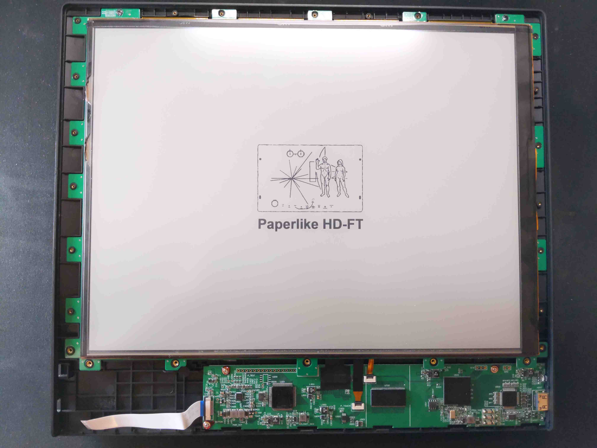
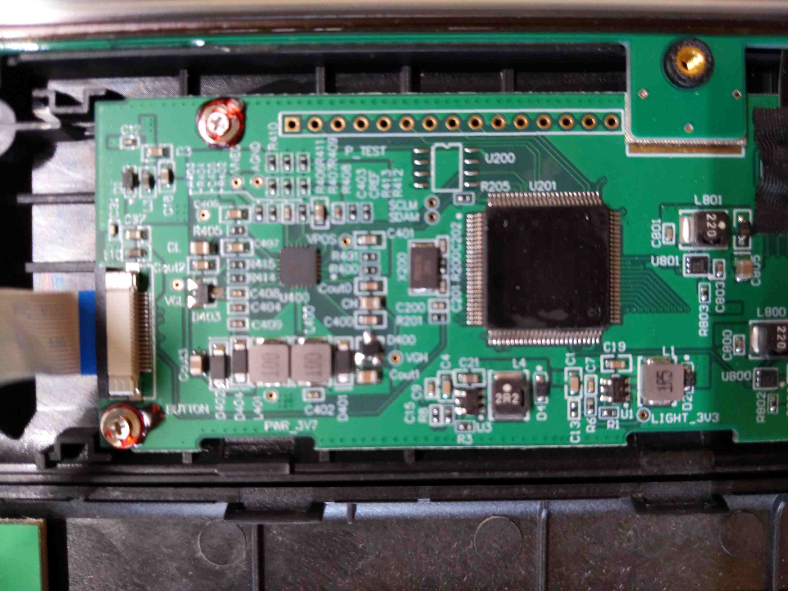
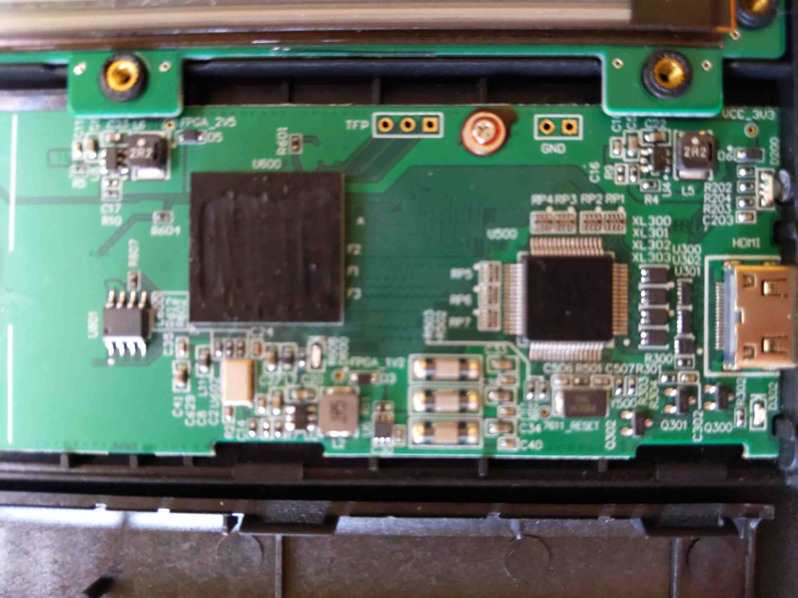

# Dasung Paperlike HD-FT teardown

## Dasung Paperlike HD-FT teardown [^zettler]

### Opening the Dasung Paperlike HD-FT
|{#avatar .ui .centered .large .image}|
|:--:|
|*Pyring open the outer bezel of the display*|

Using a knife I was able to pry out the plastic part of the Dasung Monitor where it's glued. As I pryed everything open it I noticed the screws of different sizes that are a part of the monitor / panel, keeping it in place.

|{#avatar .ui .centered .large .image}|
|:--:|
|*Removed the outer bezel of the display*|

Removed all of the screws from the dasung monitor

After removing the screws was able to remove the piece that keeps it all together.

|{#avatar .ui .centered .large .image}|
|:--:|
|**|

I was able to open it and take a closer at the PCB's similar to Zettler's observation the chip's components were chemically peeled off to prevent reverse engineering. and similarly there were two pcb's, one for the eink display and another one to control the modes of the monitor.

|{#avatar .ui .centered .large .image}|
|:--:|
|**|

|{#avatar .ui .centered .large .image}|
|:--:|
|**|

|{#avatar .ui .centered .large .image}|
|:--:|
|**|

|{#avatar .ui .centered .large .image}|
|:--:|
|**|

|{#avatar .ui .centered .large .image}|
|:--:|
|**|

|{#avatar .ui .centered .large .image}|
|:--:|
|**|

|{#avatar .ui .centered .large .image}|
|:--:|
|**|

|{#avatar .ui .centered .large .image}|
|:--:|
|**|

|{#avatar .ui .centered .large .image}|
|:--:|
|**|

|{#avatar .ui .centered .large .image}|
|:--:|
|**|

According to the panel that was disassembled, this appears to be the e-ink panel that seems to be used: ES133TT3 [^ES133TT3]:

### The Dasung E-Ink display module

### The Control Boards
