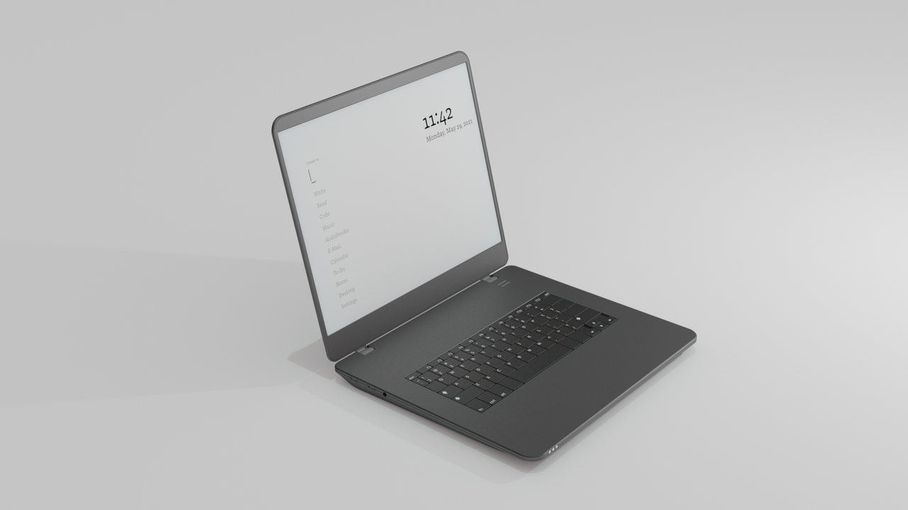
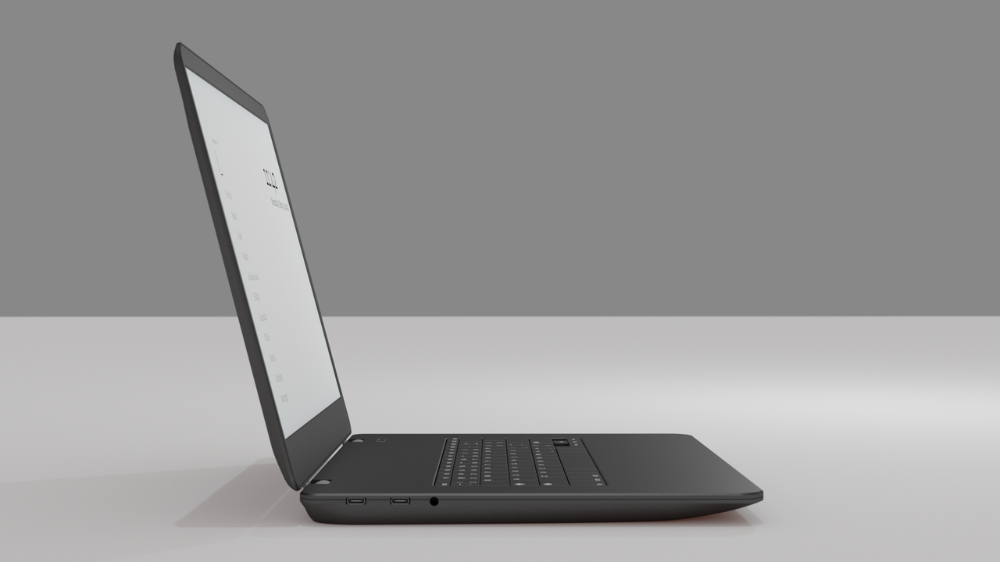
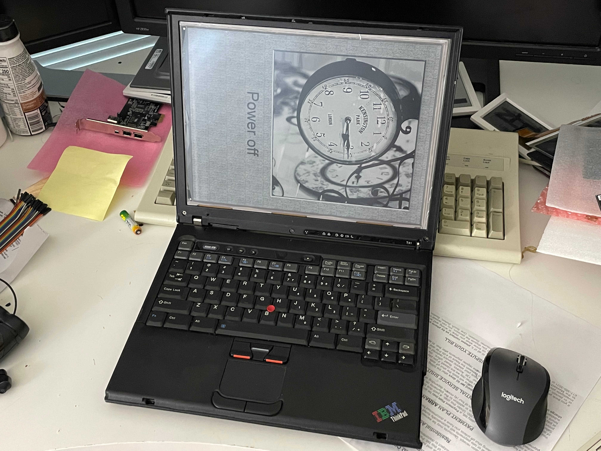
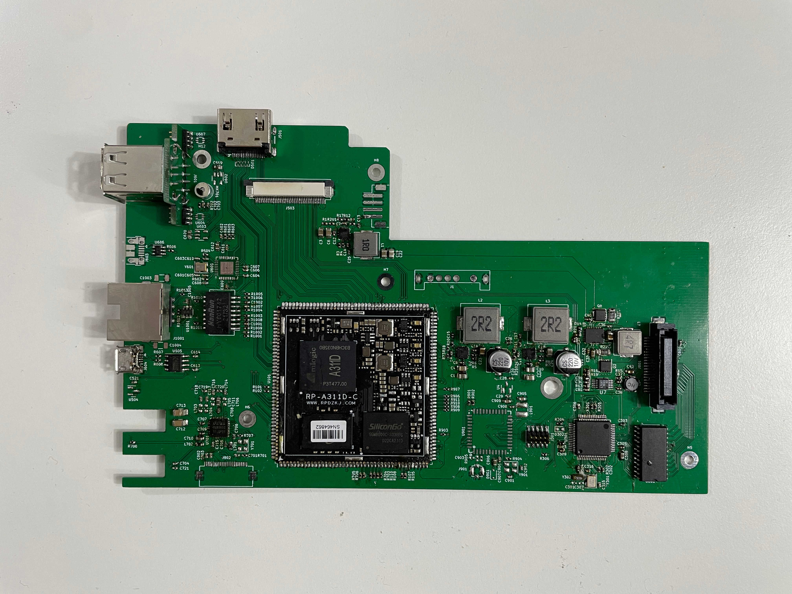
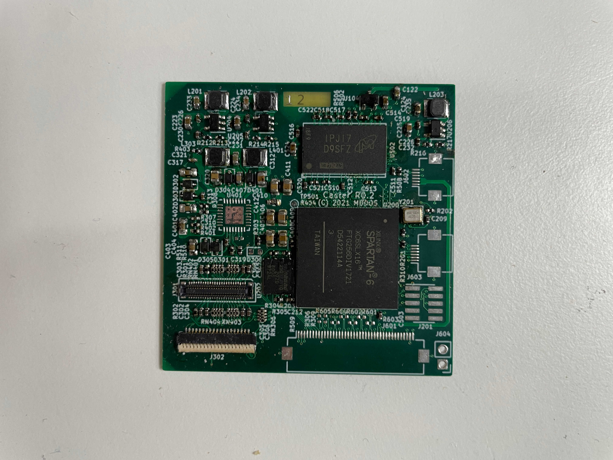

# The Modos Paper Laptop
Imagine a space that’s distraction and eyestrain-free. A place where you can just read, write, and think. Now imagine a laptop that allows you to work in your most productive environment from anywhere. A laptop that encourages you to spend less time in front of a screen and gives you back time to focus on what matters most in life.

{.ui .small .images .centered}

In today’s digital world, it’s hard to find a place for focused thinking. It’s even harder to find a device for this purpose.

At Modos, we want to give you the tools and space to focus on what truly matters in life. That’s why we created the Modos Paper Laptop: the world's first e-ink laptop designed for reading, writing, and thinking in a distraction and eyestrain-free environment.

We’re going to build this laptop with you, our community over the next year. We are excited to work from the beginning openly and transparently to create an open-hardware and open-source laptop that respects your time, attention, and well-being.

We are currently accepting applications from engineers, designers, and developers to our community pilot program. Once admitted to the community pilot program, you will receive early access to our first iteration of the Modos Paper Laptop.

We’ll provide more details about the community pilot program and the Modos Paper Laptop soon.

If you are interested in joining, Get in touch with us.

In the meantime, say hello and follow our progress on RSS, Github, Matrix, Mastodon, and Twitter.

‍

Regards,

The Modos Team

{.ui .horizontal .divider .header}

## About
{#avatar .ui .left .floated .small .image}

Hi, I’m Alexander Soto.

I’m a community organizer, educator, software engineer, hacktivist, and agent of social change. My interests are in exploring community-building, social justice, education, and leveraging technology to address social problems.

In the past, I’ve worked as a labor rights organizer, a teacher, and I’m currently the Project Lead at [EI2030](https://ei2030.org/), an Expert In Residence at [Resilient Coders](https://www.resilientcoders.org/), and founder of [Modos](https://www.modos.tech/).

I enjoy tinkering/playing/breaking things, 3D printing, painting, playing piano, swimming, and writing in my spare time.

This site is the [scattered and unfinished version of my thoughts](https://alexsoto.dev/impulse.html) while documenting what I’m currently learning and exploring.

If you’d like to know the updates of a post, have questions, comments, suggestions, or would like to collaborate, send me a [direct message](https://twitter.com/messages/compose?recipient_id=4648173315) on [Twitter](https://twitter.com/alexsotodev), or an [email](mailto:contact@alexsoto.dev) and we can talk.

<section id="subscriptionLinks"></section>

<section id="socialMediaLinks"></section>
