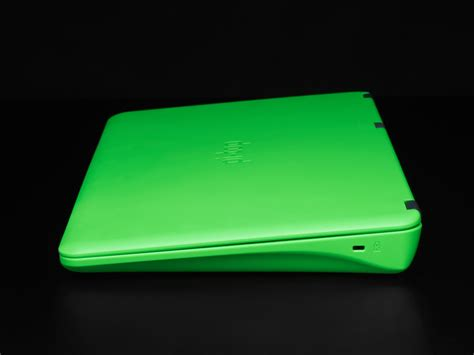

# PaperTop

[[[teardown-of-the-papertop]]]

The objective of the PaperTop is to explore creating an e-ink laptop using a Raspberry Pi 3B+, Pi-Top, and an e-ink panel. Explore what other single-board computers could be supported with the chassis. Explore what modifications to the Pi-top and what is and is not possible.

The first pi-top started as part of an IndieGoGo campaign in 2014.[^indiegogo] Since then, there have been different iterations of the pi-top. The v1 to v3 of the pi-top is of particular interest since they share a similar design. The pi-top we are using, v2, is available on eBay for about $50-80 dollars; the one shown here was purchased for $30.

## Overview

### Keyboard and Touchpad

One of the notable features of the pi-top is its keyboard and touchpad. The keyboard has a hinge mechanism allowing you to slide the keyboard a few inches down, exposing its internals.[^recanta]

The keyboard and touchpad, rather than having a proprietary connector, uses a USB interface, allowing you to easily connect it to the Raspberry Pi or any other device. When sliding the keyboard down, there is a significant amount of available space and underneath the keyboard.

### Mods

The pi-top's modular design opens up the possibilities for modifying the chassis to make it compatible with many devices.

Behind the laptop, there is an opening for the USB ports and ethernet. With a dremel, we can create a space and add an IO plate that's 3D printed to support the Raspberry Pi or other SBC's future iterations. Similarly, this approach applies to the sides of the laptops.

We can re-use the lid's hinges and re-create the lid so that an eink panel could be fitted and support a range of eink panels. Also, we can substitute the battery for a power bank or another alternative to power the pi and e-ink panel.

### Future considerations

* The available accessories for the Raspberry Pi provide or enhance existing features.
* Creating a minimal Linux distribution designed for an e-ink panel.
* Creating a similar design to the pi-top for future working groups.
* A solar-powered laptop.
* Dual-use laptop: Include a standard or full-featured Raspberry Pi and a low-power device such as a Pi-Zero some other microcontroller.

The combination of having a keyboard and mouse with a USB interface, the space and easy access to the internals, the price and availability online, and the possible modifications make the pi-top an appealing starting point for future projects to build an e-ink laptop.

The picture above shows a Dasung Paperlike HD-FT and its two PCBs easily fitting inside of the pi-top, the pi-top is an ideal candidate for this panel.

### Next Steps
- To test the longer FFC cable and molex connector with the Dasung Paperlike HD-FT.[^ffc] [^molex]
- Research possible batteries to power Raspberry Pi and e-ink panel.

Follow the progress at the [EI-2030 forums](https://forum.ei2030.org/t/papertop-laptop/136).

{.ui .horizontal .divider .header}

## About
{#avatar .ui .left .floated .small .image}

Hi, I’m Alexander Soto.

I’m a community organizer, educator, software engineer, hacktivist, and agent of social change. My interests are in exploring community-building, social justice, education, and leveraging technology to address social problems.

In the past, I’ve worked as a labor rights organizer, a teacher, and I’m currently the Project Lead at [EI2030](https://ei2030.org/), and an Expert In Residence at [Resilient Coders](https://www.resilientcoders.org/).

I enjoy tinkering/playing/breaking things, 3D printing, painting, playing piano, swimming, and writing in my spare time.

This site is the [scattered and unfinished version of my thoughts](https://alexsoto.dev/impulse.html) while documenting what I’m currently learning and exploring.

If you’d like to know the updates of a post, have questions, comments, suggestions, or would like to collaborate, send me a [direct message](https://twitter.com/messages/compose?recipient_id=4648173315) on [Twitter](https://twitter.com/alexsotodev), or an [email](mailto:contact@alexsoto.dev) and we can talk.

<section id="subscriptionLinks"></section>

<section id="socialMediaLinks"></section>

[^indiegogo]: https://www.indiegogo.com/projects/pi-top-a-raspberry-pi-laptop-you-build-yourself
[^recanta]: https://www.recantha.co.uk/blog/?p=18086
[^ffc]: https://www.molex.com/molex/products/part-detail/cable/0150151039
[^molex]: https://www.molex.com/molex/products/part-detail/ffc_fpc_connectors/5025983993
