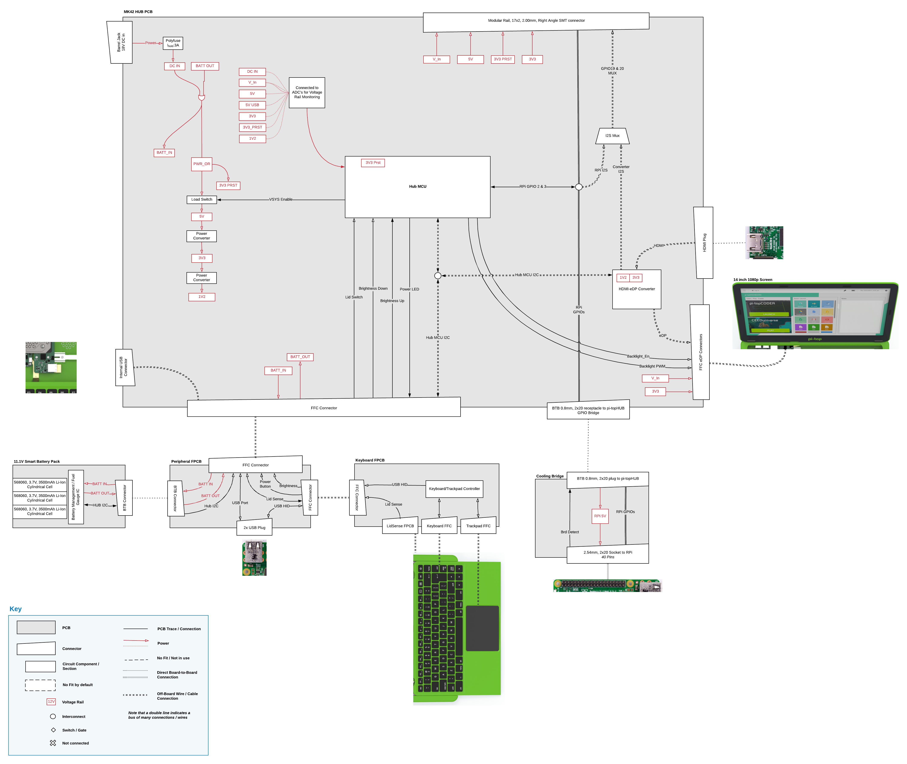
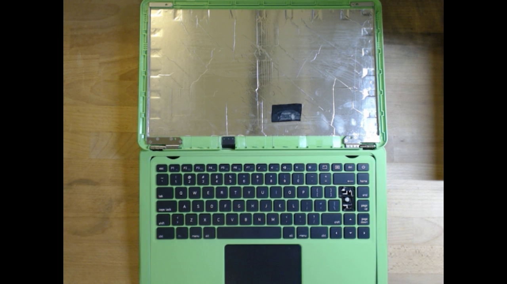
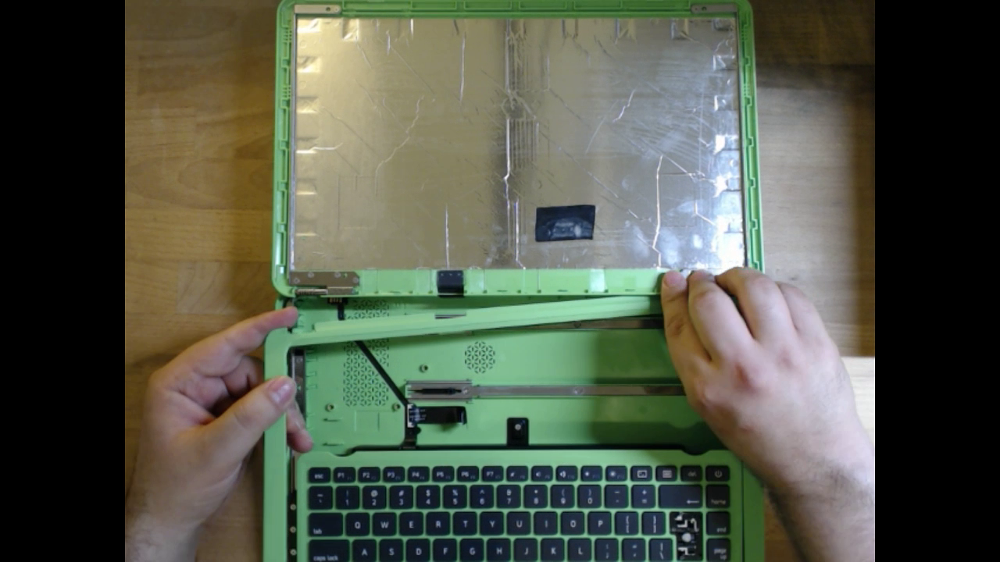
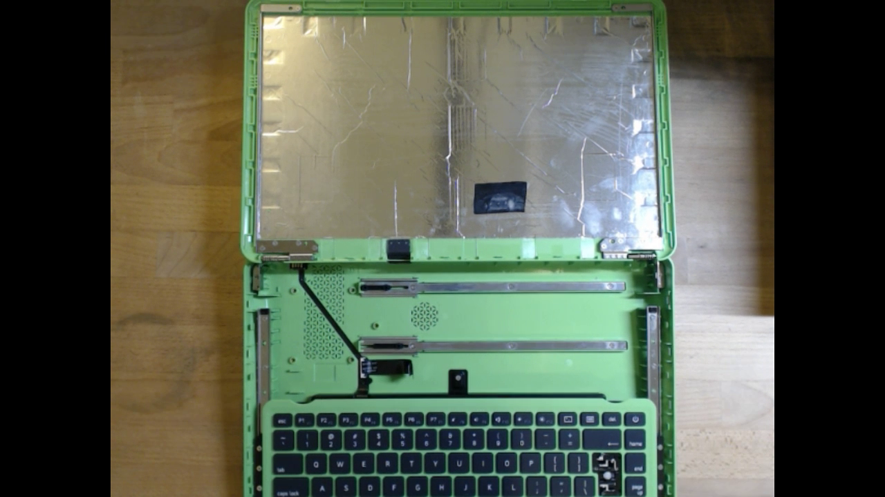
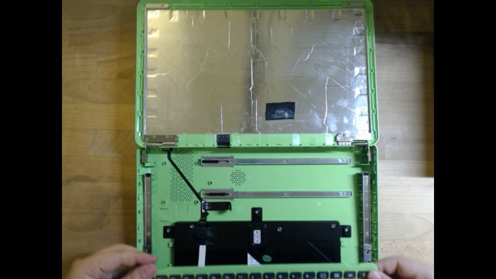
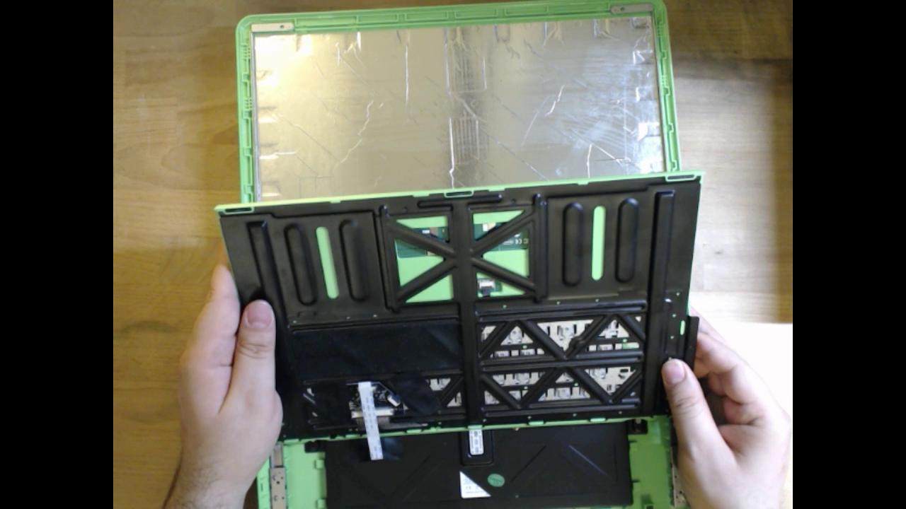
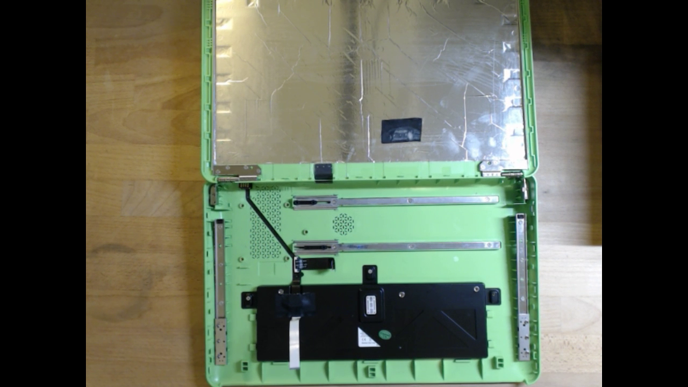
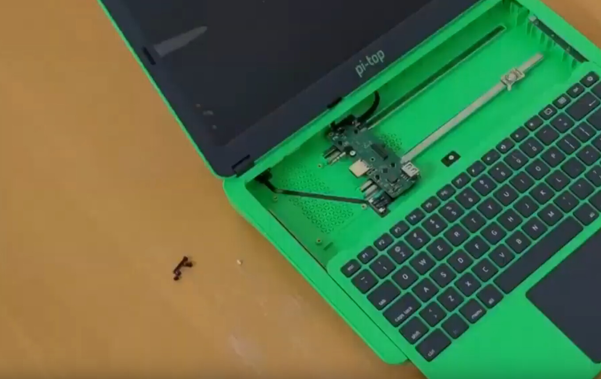
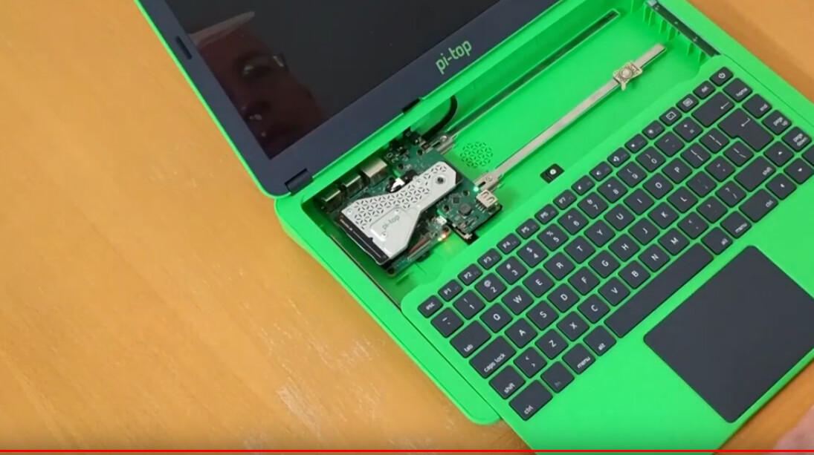

# Teardown of the PaperTop

## Block Diagram of the Pi-top v3

## Overview: Teardown

I performed a small teardown of the Pi-top to learn more about it and see what’s possible; what follows is an overview of the process and concludes with thoughts and considerations for the next steps.

I first slid out the keyboard and started removing the outer bezel of the keyboard.

Once I was able to remove out the keyboard’s outer bezel, I removed the screws that are located near the hinges to remove the keyboard.

I gently removed the keyboard and noticed that it’s attached via a ribbon cable that connects to where the battery is.

 

 

I believe the cable that connects from the battery powers the keyboard/touchpad, and the other ribbon cable on the side connects to the bridge/hub.

 

 

 

 

 

 

The hub that the pi-top created powers the Raspberry Pi using the GPIO pins. The heatsink/cooling system connects to the Pi’s GPIO pins and the connector in the hub. The hub goes on the right where the rails are and connects to the RPI3B+ on the left.

 

 

## Closing thoughts

The appeal of the pi-top is its open space/availability and the slide-out keyboard/mouse mechanism.

If it’s true that the keyboard/mouse mechanism needs to be powered using the built-in battery because of the connection, then the options/flexibility are reduced since it needs to be connected to the bridge/hub for the battery to charge.

Having the hub does reduce the space available and makes so only certain SBC are compatible with RPI3, NanoPi M4V2, among others.

## Workarounds

- Use male/female adapters (Micro HDMI - HDMI cable, Female USB - Male USB cable, 40p ribbon cable) to make the pi-top compatible with the RPI4 or other SBC’s.
- Power the keyboard and touchpad through other means, like a power bank, then we wouldn’t have to use the battery that came with the pi-top or the hub.
- Remove the keyboard/touchpad altogether, use a wireless keyboard with a dongle, and re-use its rails.

The pi-top’s overall design is easy to access; its open chassis has prospects for modding and would be an excellent device for to build-upon if we can address some of the obstacles.

Follow the progress at the [EI-2030 forums](https://forum.ei2030.org/t/papertop-laptop/136).

{.ui .horizontal .divider .header}

## About
{#avatar .ui .left .floated .small .image}

Hi, I’m Alexander Soto.

I’m a community organizer, educator, software engineer, hacktivist, and agent of social change. My interests are in exploring community-building, social justice, education, and leveraging technology to address social problems.

In the past, I’ve worked as a labor rights organizer, a teacher, and I’m currently the Project Lead at [EI2030](https://ei2030.org/), an Expert In Residence at [Resilient Coders](https://www.resilientcoders.org/), and founder of [Modos](https://www.modos.tech/).

I enjoy tinkering/playing/breaking things, 3D printing, painting, playing piano, swimming, and writing in my spare time.

This site is the [scattered and unfinished version of my thoughts](https://alexsoto.dev/impulse.html) while documenting what I’m currently learning and exploring.

If you’d like to know the updates of a post, have questions, comments, suggestions, or would like to collaborate, send me a [direct message](https://twitter.com/messages/compose?recipient_id=4648173315) on [Twitter](https://twitter.com/alexsotodev), or an [email](mailto:contact@alexsoto.dev) and we can talk.

<section id="subscriptionLinks"></section>

<section id="socialMediaLinks"></section>

